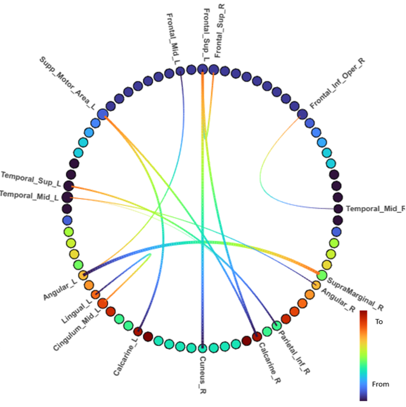

# Visualize effective connectivity in circular layout with AAL atlas #

### Author: Trang Le ###

### This code is to visualize effective connectivity in circular layout with AAL atlas. ###

 

[Link to interactive version, have to download to see html file](https://htmlpreview.github.io/?https://github.com/Trang0412/AAL_atlas_in_circular_graph/blob/master/sample/listening_animal_106_133_ms.html)

* Regions belong to same lobe have same color (currenlty using Turbo256 color palette). 

* Edges has multiple color to indicate direction of the connection between 2 nodes, where blue color indicates the 'from' node, and red color indicates the 'to' node. 

## Environment ##
  * python=3.10.8
  * bokeh=3.0.2
  * networkx=2.8.8
  * pandas

## Require input ##
  1. Excel file of data for connectivity, named 'Conn_for_graph.xlsx', as formatted file in **sample** folder
  2. Excel file of layout for atlas, 'groupSIFT_atlas.xlsx'
   

